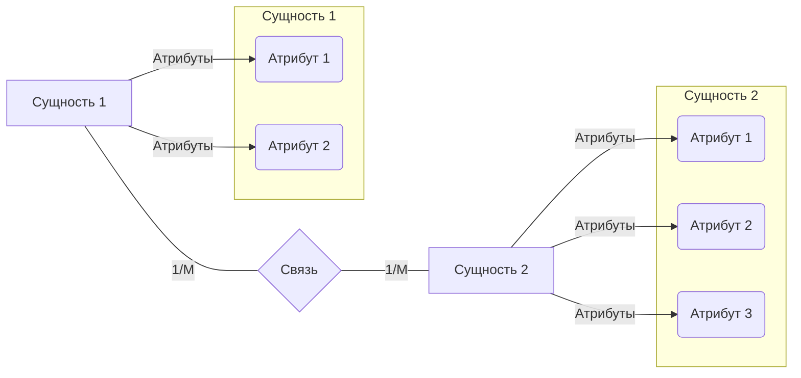

*(Эта глава основана на материалах Лекции 2: "Создание Базы Данных")*

### Часть 1: Этапы Построения БД

Создание базы данных — это процесс, который проходит через несколько уровней абстракции.

1.  **Определение Предметной Области:**
    *   **Предметная область** — это та часть реального мира, данные о которой мы хотим хранить и обрабатывать в БД. Примеры: учебный процесс в университете, работа интернет-магазина, учет товаров на складе.
    *   На этом этапе мы собираем требования, общаемся с будущими пользователями системы, анализируем существующие процессы.

2.  **Уровни Представления Данных:**

    *   **Пользовательский уровень:** Как разные пользователи видят и взаимодействуют с данными. Обычно пользователь работает только с *частью* системы и имеет *неполное* представление о ней в целом. Пользователю не важно, как данные физически хранятся, как оптимизируются запросы или как происходит поиск. Информация собирается в виде текстов, диаграмм, интервью.
    *   **Инфологический уровень:** Создание обобщенной, неформальной модели предметной области, которая не зависит от конкретной СУБД или модели данных.
        *   Собирается на основе анализа пользовательских представлений.
        *   Не зависит от "физического" хранилища.
        *   Использует стандартные средства описания, например, **ER-диаграммы** (Entity-Relationship).
        *   Цель – описать сущности, их атрибуты и связи между ними.
    *   **Даталогический уровень:** Представление инфологической модели с учетом конкретной *модели данных* (в нашем случае — реляционной) и особенностей конкретной *СУБД*.
        *   Здесь появляются детали, специфичные для СУБД (например, конкретные типы данных: `integer`, `text` в PostgreSQL).
        *   ER-модель преобразуется в набор таблиц (отношений).
    *   **Физический уровень:** Реализация даталогической модели средствами конкретной СУБД.
        *   Зависит от особенностей СУБД.
        *   Описывается на языке, поддерживаемом СУБД (в нашем случае — **SQL**).
        *   Пример: SQL-код для создания таблиц (`CREATE TABLE STUDENT (...)`).

3.  **Проектирование "Сверху-Вниз" (Top-Down Approach):**
    Мы движемся от общего к частному:
    1.  Анализ предметной области (Пользовательский уровень).
    2.  Построение инфологической модели (ER-диаграмма).
    3.  Преобразование в даталогическую модель (схема таблиц с типами данных).
    4.  Физическая реализация (SQL-код для создания таблиц и других объектов).

### Часть 2: Инфологическая Модель (ER-модель)

Один из самых популярных инструментов для инфологического моделирования — **ER-диаграммы (Entity-Relationship)**, предложенные **Питером Ченом** (IBM, 1976).

**Основные элементы ER-модели:**

*   **Сущность (Entity):** Класс реальных или абстрактных объектов, информация о которых должна храниться в БД (например, СТУДЕНТ, ГРУППА, ЭКЗАМЕН, ПРЕПОДАВАТЕЛЬ). На диаграммах обычно изображается **прямоугольником**.
*   **Экземпляр сущности (Entity Instance):** Конкретный объект данного класса (например, студент "Иван Иванов", группа "P3100").
*   **Атрибут (Attribute):** Характеристика (свойство) сущности, имеющая имя и тип данных (например, у сущности СТУДЕНТ могут быть атрибуты: `ID_Студента`, `Имя`, `Фамилия`, `Дата_Рождения`). На диаграммах обычно изображается **овалом**, связанным с сущностью.
*   **Связь (Relationship):** Ассоциация между двумя или более сущностями, отражающая их взаимодействие (например, студент *принадлежит* группе, студент *сдает* экзамен). На диаграммах обычно изображается **ромбом**, связанным с сущностями, которые он соединяет.

**Изображение элементов (Нотация Чена - упрощенно):**



*   **Степень связи (Мощность, Кардинальность):** Указывает, сколько экземпляров одной сущности может быть связано с одним экземпляром другой сущности. Обозначается как `1` (один) или `M` (много, иногда `N` или `*`).

**Типы связей (по степени):**

1.  **Один-к-одному (1:1):** Каждому экземпляру первой сущности соответствует не более одного экземпляра второй, и наоборот.
    *   *Пример:* ГРУППА —(1)— Староста —(1)— СТУДЕНТ (Предполагаем, что у группы ровно один староста, и студент может быть старостой только в одной группе).

    ```mermaid
    graph LR
        Группа -- 1 --- Староста{Староста} -- 1 --- Студент
    ```

2.  **Один-ко-многим (1:M):** Одному экземпляру первой сущности может соответствовать ноль, один или несколько экземпляров второй, но одному экземпляру второй сущности соответствует не более одного экземпляра первой.
    *   *Пример:* ГРУППА —(1)— Принадлежность —(M)— СТУДЕНТ (В одной группе много студентов, но каждый студент принадлежит только одной группе).

    ```mermaid
    graph LR
        Группа -- 1 --- Принадлежность{Принадлежность} -- M --- Студент
    ```

3.  **Многие-к-одному (M:1):** Зеркальная связь 1:M. Одному экземпляру первой сущности соответствует не более одного экземпляра второй, но одному экземпляру второй может соответствовать ноль, один или несколько экземпляров первой.
    *   *Пример:* СТУДЕНТ —(M)— Принадлежность —(1)— ГРУППА (Много студентов в одной группе).

4.  **Многие-ко-многим (M:M):** Одному экземпляру первой сущности может соответствовать ноль, один или несколько экземпляров второй, и наоборот.
    *   *Пример:* СТУДЕНТ —(M)— Процесс сдачи —(M)— ЭКЗАМЕН (Один студент может сдавать много экзаменов, и один экзамен могут сдавать много студентов).

    ```mermaid
    graph LR
        Студент -- M --- Процесс_сдачи{Процесс сдачи} -- M --- Экзамен
    ```

**Важно:** Связи M:1 и 1:M — это одна и та же связь, просто рассмотренная с разных сторон. Поэтому часто выделяют только 3 типа связей: 1:1, 1:M, M:M.

**Сложные и Тернарные связи:**

*   Между двумя сущностями может быть **несколько связей** разного типа (например, Группа-Студент связаны как "Принадлежность" (1:M) и "Староста" (1:1)).
*   **Тернарная связь:** Связь, соединяющая **три** сущности.
    *   *Пример:* СТУДЕНТ, ПРЕПОДАВАТЕЛЬ, ЭКЗАМЕН связаны через "Проведение экзамена".

    ```mermaid
     graph TD
         ПЭ{Проведение экзамена} -- M --- Студент
         ПЭ -- M --- Преподаватель
         ПЭ -- M --- Экзамен
    ```

**Классификация сущностей (по Э. Кодду):**

*   **Стержневая сущность (Kernel Entity):** Независимая, базовая сущность, которая может существовать сама по себе (например, СТУДЕНТ, ГРУППА).
*   **Ассоциативная сущность (Associative Entity):** Сущность, возникающая для представления связи **M:M** между двумя или более сущностями. Она "ассоциирует" экземпляры других сущностей. (Пример: таблица `STUD_TO_EXAM` для связи СТУДЕНТ-ЭКЗАМЕН).
*   **Характеристическая сущность (Characteristic Entity):** Сущность, которая описывает или уточняет другую сущность и не может существовать без нее. Обычно связана с основной сущностью связью **M:1** или **1:1**. (Пример: если бы у студента было несколько телефонов, можно было бы вынести их в отдельную сущность ТЕЛЕФОН, которая была бы характеристической для СТУДЕНТА).

**Ключи в инфологической модели:**

*   **Ключ (Key):** Минимальный набор атрибутов, уникально идентифицирующий экземпляр сущности.
*   **Суррогатный ключ (Surrogate Key):** Искусственно добавленный атрибут (обычно числовой идентификатор, например, `student_id`), который используется как ключ для уникальной идентификации экземпляра. Часто используется вместо "естественных" ключей (как ФИО+ДатаРождения), так как он проще, стабильнее и эффективнее для связей.

### Часть 3: Создание Реляционной БД на SQL

Переходим от инфологической модели к даталогической и физической. Наша цель — создать таблицы в PostgreSQL с помощью SQL.

**Объекты Базы Данных:**

В БД есть разные объекты: таблицы, представления (виртуальные таблицы), индексы, последовательности, функции, процедуры, триггеры и т.д. Основной объект, с которым мы начнем работать, — это **таблица**.

**Язык SQL: Составляющие**

Как и любой язык, SQL состоит из базовых элементов:

1.  **Предложения (Clauses/Statements):** Команды, которые выполняют определенное действие (`CREATE TABLE ...;`, `SELECT * FROM ...;`). Заканчиваются точкой с запятой (;).
2.  **Идентификаторы (Identifiers):** Имена объектов БД (таблиц, колонок, функций и т.д.). Могут быть системными или определенными пользователем. Используются для обращения к объектам (например, `STUDENTS` в `SELECT * FROM STUDENTS;`).
3.  **Ключевые слова (Keywords):** Зарезервированные слова языка, имеющие специальное значение (`SELECT`, `FROM`, `WHERE`, `CREATE`, `TABLE`, `INTEGER` и т.д.). Обычно пишутся заглавными буквами для читаемости, хотя SQL часто нечувствителен к регистру для ключевых слов.
4.  **Константы (Constants/Literals):** Фиксированные значения, не являющиеся идентификаторами или ключевыми словами.
    *   Числовые: `123`, `3.14`, `5E6` (5 * 10^6)
    *   Строковые: `'Пример строки'` (в одинарных кавычках!)
    *   Дата/Время: `'2023-10-27'`, `'2023-10-27 10:00:00'` (формат зависит от СУБД и настроек, стандартный ISO 8601 предпочтителен)
    *   Булевы: `TRUE`, `FALSE` (и специальное значение `NULL`)
5.  **Операторы (Operators):** Символы, обозначающие действия над операндами (константами, значениями колонок).
    *   Арифметические: `+`, `-`, `*`, `/`
    *   Сравнения: `=`, `>`, `<`, `>=`, `<=`, `<>` или `!=` (не равно)
    *   Логические: `AND`, `OR`, `NOT`
    *   Присваивания (в `UPDATE`): `=`
    *   И другие (`LIKE`, `IN`, `BETWEEN` и т.д.)

**Пример разбора предложения:**

```sql
SELECT * FROM STUDENTS WHERE AGE > 19;
```

*   `SELECT`, `FROM`, `WHERE`: Ключевые слова
*   `*`: Специальный символ (означает "все колонки")
*   `STUDENTS`: Идентификатор (имя таблицы)
*   `AGE`: Идентификатор (имя колонки)
*   `>`: Оператор сравнения
*   `19`: Константа (числовая)
*   `;`: Завершение предложения

### Часть 4: Работа с Таблицами (DDL)

**Типы таблиц:**

*   **Базовые таблицы:** Реально существуют, хранятся на диске. Мы создаем их с помощью `CREATE TABLE`.
*   **Виртуальные таблицы:** Не существуют постоянно, их содержимое вычисляется в момент запроса. Основной вид — **представления (Views)**. Также сюда можно отнести результаты запросов, курсоры.

**Создание базовой таблицы (`CREATE TABLE`)**

Основная команда для создания структуры таблицы.

**Синтаксис:**

```sql
CREATE TABLE имя_таблицы (
    имя_колонки1 тип_данных1 [ограничения_колонки1],
    имя_колонки2 тип_данных2 [ограничения_колонки2],
    ...
    [ограничения_таблицы]
);
```

**Пример:**

```sql
-- Создаем таблицу студентов
CREATE TABLE students (
    stud_id    INTEGER,      -- ID студента (целое число)
    stud_name  TEXT,         -- Имя студента (текст произвольной длины)
    birth_date DATE          -- Дата рождения (дата)
);
```

**Ввод/Вывод:**

*   **Ввод (SQL команда):**
    ```sql
    CREATE TABLE students (
        stud_id    INTEGER,
        stud_name  TEXT,
        birth_date DATE
    );
    ```
*   **Вывод (Сообщение от СУБД):**
    ```
    CREATE TABLE
    ```
    (Это сообщение означает, что таблица успешно создана).

**Удаление таблицы (`DROP TABLE`)**

Удаляет таблицу и *все* данные в ней. Используйте с осторожностью!

**Синтаксис:**

```sql
DROP TABLE имя_таблицы;
```

**Пример:**

```sql
DROP TABLE students;
```

**Ввод/Вывод:**

*   **Ввод (SQL команда):**
    ```sql
    DROP TABLE students;
    ```
*   **Вывод (Сообщение от СУБД):**
    ```
    DROP TABLE
    ```

**Изменение таблицы (`ALTER TABLE`)**

Позволяет менять структуру существующей таблицы: добавлять, удалять, изменять колонки, добавлять/удалять ограничения.

**Синтаксис (примеры):**

```sql
-- Добавить колонку
ALTER TABLE имя_таблицы ADD COLUMN имя_новой_колонки тип_данных [ограничения];

-- Удалить колонку
ALTER TABLE имя_таблицы DROP COLUMN имя_колонки;

-- Изменить тип колонки (синтаксис может отличаться)
ALTER TABLE имя_таблицы ALTER COLUMN имя_колонки TYPE новый_тип_данных;
```

**Примеры:**

```sql
-- Добавляем колонку для номера группы в таблицу students
ALTER TABLE students ADD COLUMN group_name TEXT;

-- Удаляем колонку с датой рождения
ALTER TABLE students DROP COLUMN birth_date;
```

**Ввод/Вывод:**

*   **Ввод (SQL команда):**
    ```sql
    ALTER TABLE students ADD COLUMN group_name TEXT;
    ```
*   **Вывод (Сообщение от СУБД):**
    ```
    ALTER TABLE
    ```
*   **Ввод (SQL команда):**
    ```sql
    ALTER TABLE students DROP COLUMN birth_date;
    ```
*   **Вывод (Сообщение от СУБД):**
    ```
    ALTER TABLE
    ```

### Часть 5: Типы Данных в PostgreSQL

Каждая колонка в таблице должна иметь **тип данных**. Тип данных:

*   Определяет, какие значения могут храниться в колонке.
*   Определяет "смысл" данных и какие операции с ними можно выполнять.
*   Влияет на объем памяти, занимаемый данными.

Тип данных задается при создании таблицы (`CREATE TABLE`) или добавлении колонки (`ALTER TABLE ADD COLUMN`).

**Основные типы данных в PostgreSQL:**

1.  **Числовые типы:**
    *   `SMALLINT`: Целые числа, 2 байта (диапазон от -32768 до +32767).
    *   `INTEGER` (или `INT`): Целые числа, 4 байта (около ±2 миллиардов). Самый распространенный целый тип.
    *   `BIGINT`: Целые числа, 8 байт (очень большой диапазон).
    *   `NUMERIC(precision, scale)` или `DECIMAL(precision, scale)`: Числа с фиксированной точностью. `precision` - общее число знаков, `scale` - число знаков после запятой. Используется для финансовых расчетов, где важна точность. Пример: `NUMERIC(10, 2)` - до 10 цифр всего, 2 из них после запятой.
    *   `REAL`: Числа с плавающей точкой, одинарная точность (4 байта).
    *   `DOUBLE PRECISION` (или `FLOAT8`): Числа с плавающей точкой, двойная точность (8 байт).

2.  **Символьные (строковые) типы:**
    *   `CHARACTER VARYING(n)` или `VARCHAR(n)`: Строка переменной длины с ограничением максимальной длины `n`.
    *   `CHARACTER(n)` или `CHAR(n)`: Строка фиксированной длины `n`. Если строка короче `n`, она дополняется пробелами до длины `n`. Используется редко.
    *   `TEXT`: Строка переменной длины без явного ограничения (но есть технические ограничения). Самый удобный и часто используемый тип для текста в PostgreSQL.

    **Пример использования `CHAR(n)`:**
    ```sql
    CREATE TABLE test_char (
        fixed_name CHAR(10)
    );

    INSERT INTO test_char (fixed_name) VALUES ('Valery');

    -- При выборке 'Valery' будет дополнено пробелами до 10 символов: 'Valery    '
    SELECT fixed_name, length(fixed_name) FROM test_char;
    ```
    **Вывод:**
    ```
     fixed_name | length
    ------------+--------
     Valery     |     10
    (1 row)
    ```

3.  **Логический тип:**
    *   `BOOLEAN`: Может принимать значения `TRUE`, `FALSE` или `NULL`.
    *   В PostgreSQL можно задавать разными способами:
        *   `TRUE`: `TRUE`, `'true'`, `'t'`, `'yes'`, `'y'`, `'on'`, `'1'`
        *   `FALSE`: `FALSE`, `'false'`, `'f'`, `'no'`, `'n'`, `'off'`, `'0'`
    *   Рекомендуется использовать `TRUE` и `FALSE`.

4.  **Типы даты/времени:**
    *   `DATE`: Хранит только дату (год, месяц, день). Пример: `'2023-10-27'`.
    *   `TIME [ WITHOUT TIME ZONE ]`: Хранит только время суток. Пример: `'11:30:00'`.
    *   `TIMESTAMP [ WITHOUT TIME ZONE ]`: Хранит дату и время. Пример: `'2023-10-27 11:30:00'`.
    *   `TIMESTAMP WITH TIME ZONE` (или `TIMESTAMPTZ`): Хранит дату и время с учетом часового пояса. Значение хранится в UTC, а при отображении конвертируется в текущий часовой пояс сессии. Это предпочтительный тип для хранения моментов времени. Пример: `'2023-10-27 11:30:00+03'`.
    *   `INTERVAL`: Хранит временной интервал (разницу между двумя моментами времени). Пример: `INTERVAL '2 days'`, `INTERVAL '1 hour 30 minutes'`.

**Пример с типами:**

```sql
CREATE TABLE exams (
    exam_id    INTEGER,    -- ID экзамена
    exam_name  TEXT,       -- Название экзамена
    exam_date  TIMESTAMPTZ -- Дата и время проведения с часовым поясом
);
```

### Часть 6: NULL-значения

`NULL` — это специальное значение в SQL, которое означает **отсутствие или неизвестность информации**.

*   **Важно:** `NULL` — это **не** пустая строка (`''`), не ноль (`0`), не пробел (`' '`). Это именно "ничего".
*   **Сравнение с `NULL`:** Любое сравнение с `NULL` (кроме специальных операторов `IS NULL` и `IS NOT NULL`) дает результат `NULL` (что в контексте `WHERE` обычно интерпретируется как `FALSE`).
    *   `NULL = NULL` дает `NULL` (не `TRUE`)
    *   `5 = NULL` дает `NULL`
    *   `5 > NULL` дает `NULL`
    *   Чтобы проверить, является ли значение `NULL`, используйте:
        *   `column_name IS NULL`
        *   `column_name IS NOT NULL`

*   **Агрегатные функции и `NULL`:** Большинство агрегатных функций (`SUM`, `AVG`, `MIN`, `MAX`, `COUNT(column_name)`) **игнорируют** `NULL`-значения при подсчете.
    *   Исключение: `COUNT(*)` считает все строки, независимо от `NULL`.

**Пример с `COUNT` и `NULL`:**

Рассмотрим таблицу `STUDENT` из слайда 50:

| id | name     | surname | gr\_id |
| :- | :------- | :------ | :----- |
| 1  | Григорий | Иванов  | 34     |
| 2  | Григорий | Петров  | `NULL` |
| 3  | Иван     | Сидоров | `NULL` |

**Запрос 1:**

```sql
SELECT COUNT(gr_id) FROM STUDENT
WHERE gr_id IS NULL;
```

*   **Объяснение:** Сначала `WHERE gr_id IS NULL` отбирает строки с `id=2` и `id=3`. Затем `COUNT(gr_id)` пытается посчитать количество *не-NULL* значений в колонке `gr_id` для отобранных строк. Так как в обеих строках `gr_id` равен `NULL`, агрегатная функция их игнорирует.
*   **Вывод:**
    ```
     count
    -------
         0
    (1 row)
    ```

**Запрос 2:**

```sql
SELECT COUNT(*) FROM STUDENT
WHERE gr_id IS NULL;
```

*   **Объяснение:** Сначала `WHERE gr_id IS NULL` отбирает строки с `id=2` и `id=3`. Затем `COUNT(*)` считает количество *отобранных строк*. Их две.
*   **Вывод:**
    ```
     count
    -------
         2
    (1 row)
    ```

*   **`NULL` в `DISTINCT`, `ORDER BY`, `GROUP BY`:** В этих операциях все `NULL`-значения считаются **одинаковыми**.

### Часть 7: Ограничения целостности (Constraints)

Типы данных — это первый уровень ограничений, но их часто недостаточно. SQL позволяет определять более сложные правила для колонок и таблиц — **ограничения целостности (constraints)**.

1.  **`CHECK`**
    *   Позволяет задать логическое выражение, которое должно быть истинным (`TRUE`) или неизвестным (`NULL`) для любого значения, вставляемого или обновляемого в колонке (или для строки, если это ограничение таблицы). Если выражение ложно (`FALSE`), операция не будет выполнена (вызовет ошибку).
    *   Используется для реализации пользовательских правил (диапазоны значений, зависимости между колонками и т.д.).

    **Пример (ограничение колонки):** Количество несданных курсов не может быть отрицательным.
    ```sql
    CREATE TABLE students (
        st_id            INTEGER,
        st_name          TEXT,
        failed_courses   INTEGER CHECK (failed_courses >= 0) -- Ограничение CHECK
    );

    -- Попытка вставки некорректных данных
    INSERT INTO students (st_id, st_name, failed_courses) VALUES (1, 'Test', -1);
    ```
    **Вывод при ошибке:**
    ```
    ERROR:  new row for relation "students" violates check constraint "students_failed_courses_check"
    DETAIL:  Failing row contains (1, Test, -1).
    ```

    **Пример (ограничение таблицы):** Количество несданных курсов не должно превышать максимальное количество.
    ```sql
    CREATE TABLE students (
        st_id            INTEGER,
        failed_max       INTEGER,
        failed_courses   INTEGER,
        CONSTRAINT fcrs CHECK ( -- Задаем имя ограничению 'fcrs'
            failed_courses >= 0 AND failed_courses <= failed_max
        )
    );
    ```
    *Задание имени (`CONSTRAINT fcrs`) полезно для управления ограничением в будущем (например, для его удаления) и для понимания сообщений об ошибках.*

2.  **`NOT NULL`**
    *   Простое ограничение, запрещающее хранить `NULL` в колонке. Каждая строка *должна* иметь значение в этой колонке.
    *   Логически эквивалентно `CHECK (column_name IS NOT NULL)`.

    **Пример:** ID студента, максимальное и текущее число несданных курсов не могут быть `NULL`.
    ```sql
    CREATE TABLE students (
        st_id            INTEGER NOT NULL,
        failed_max       NUMERIC NOT NULL,
        failed_courses   INTEGER NOT NULL
    );
    ```

3.  **`UNIQUE`**
    *   Гарантирует, что все значения в колонке (или комбинации значений в группе колонок) уникальны в пределах таблицы.
    *   Допускает наличие `NULL`-значений (и несколько строк могут иметь `NULL`, так как `NULL` не равен `NULL`).

    **Пример (ограничение колонки):** ID студента должен быть уникальным (и не `NULL`).
    ```sql
    CREATE TABLE students (
        st_id      INTEGER NOT NULL UNIQUE,
        st_name    TEXT NOT NULL,
        st_surname TEXT NOT NULL,
        st_birth   DATE NOT NULL
    );
    ```

    **Пример (ограничение таблицы):** Комбинация имени, фамилии и даты рождения должна быть уникальной.
    ```sql
    CREATE TABLE students (
        st_id      INTEGER NOT NULL UNIQUE, -- ID тоже уникален
        st_name    TEXT NOT NULL,
        st_surname TEXT NOT NULL,
        st_birth   DATE NOT NULL,
        UNIQUE (st_name, st_surname, st_birth) -- Уникальность для группы колонок
    );
    ```

4.  **`PRIMARY KEY` (Первичный ключ)**
    *   Обозначает одну или несколько колонок, которые уникально идентифицируют каждую строку в таблице.
    *   Является комбинацией ограничений `NOT NULL` и `UNIQUE`.
    *   В таблице может быть **только один** первичный ключ.
    *   В PostgreSQL на колонку(и) первичного ключа автоматически создается `UNIQUE` B-Tree индекс для быстрого поиска.

    **Пример:**
    ```sql
    CREATE TABLE students (
        st_id      INTEGER PRIMARY KEY, -- Объявление первичного ключа для одной колонки
        st_name    TEXT NOT NULL,
        st_surname TEXT NOT NULL,
        st_birth   DATE NOT NULL,
        UNIQUE (st_name, st_surname, st_birth) -- Дополнительное ограничение уникальности
    );
    ```
    *Если первичный ключ составной (из нескольких колонок), он объявляется как ограничение таблицы:*
    ```sql
    CREATE TABLE student_exams (
        st_id   INTEGER,
        ex_id   INTEGER,
        grade   INTEGER,
        PRIMARY KEY (st_id, ex_id) -- Составной первичный ключ
    );
    ```

5.  **`FOREIGN KEY` (Внешний ключ) и `REFERENCES`**
    *   Обеспечивает **ссылочную целостность** между двумя таблицами.
    *   Указывает, что значения в колонке(ах) одной таблицы (дочерней) должны соответствовать значениям в колонке(ах) первичного (или уникального) ключа другой таблицы (родительской).
    *   Позволяет реализовать связи (1:1, 1:M) между сущностями.

    **Пример (связь 1:M между GROUP и STUDENT):**
    ```sql
    -- Родительская таблица
    CREATE TABLE groups (
        gr_id   INTEGER PRIMARY KEY, -- Первичный ключ
        gr_name TEXT
    );

    -- Дочерняя таблица
    CREATE TABLE students (
        st_id   INTEGER PRIMARY KEY,
        st_name TEXT,
        gr_id   INTEGER REFERENCES groups (gr_id) -- Внешний ключ ссылается на groups.gr_id
                                                  -- Если имя колонки совпадает с PK родителя, (gr_id) можно опустить
                                                  -- ALTERNATIVE: gr_id INTEGER REFERENCES groups
    );
    ```
    *Здесь `students.gr_id` ссылается на `groups.gr_id`. Это значит, что в `students.gr_id` можно вставить только те значения `gr_id`, которые уже существуют в таблице `groups`, либо `NULL` (если не запрещено `NOT NULL`).*

    **Пример с данными:**
    ```sql
    INSERT INTO groups (gr_id, gr_name) VALUES (1, 'P3100');
    INSERT INTO groups (gr_id, gr_name) VALUES (2, 'P3101');

    -- Эта вставка успешна
    INSERT INTO students (st_id, st_name, gr_id) VALUES (101, 'Иванов', 1);
    -- Эта вставка вызовет ошибку, т.к. группы с gr_id=3 нет
    INSERT INTO students (st_id, st_name, gr_id) VALUES (102, 'Петров', 3);
    ```
    **Вывод при ошибке:**
    ```
    ERROR:  insert or update on table "students" violates foreign key constraint "students_gr_id_fkey"
    DETAIL:  Key (gr_id)=(3) is not present in table "groups".
    ```

    **Действия при обновлении/удалении родительской записи (`ON DELETE`, `ON UPDATE`):**
    Что должно произойти с дочерними записями (студентами), если родительская запись (группа) удаляется или ее первичный ключ изменяется?
    *   `RESTRICT` (По умолчанию): Запретить операцию над родительской записью, если есть связанные дочерние.
    *   `NO ACTION`: То же, что и `RESTRICT`, но проверка выполняется в конце транзакции (если ограничения отложенные).
    *   `CASCADE`: Выполнить ту же операцию над дочерними записями (удалить/обновить связанные строки). **Опасно!**
    *   `SET NULL`: Установить значение внешнего ключа в дочерних записях в `NULL`. (Колонка FK должна допускать `NULL`).
    *   `SET DEFAULT`: Установить значение внешнего ключа в дочерних записях в значение по умолчанию (`DEFAULT`). (Для колонки FK должно быть задано значение по умолчанию).

    **Пример с `ON DELETE CASCADE`:**
    ```sql
    DROP TABLE students; -- Удалим старую таблицу

    CREATE TABLE students (
        st_id   INTEGER PRIMARY KEY,
        st_name TEXT,
        gr_id   INTEGER REFERENCES groups (gr_id)
                        ON DELETE CASCADE -- При удалении группы удалить и студентов
                        ON UPDATE CASCADE -- При изменении gr_id группы изменить и у студентов
    );

    INSERT INTO students (st_id, st_name, gr_id) VALUES (101, 'Иванов', 1);
    INSERT INTO students (st_id, st_name, gr_id) VALUES (102, 'Петров', 1);

    -- Эта команда удалит группу с ID=1 И студентов с ID=101, 102
    DELETE FROM groups WHERE gr_id = 1;
    ```

### Часть 8: Отображение ER-диаграмм в Реляционную БД

Как преобразовать ER-модель в набор таблиц SQL:

1.  **Сущность → Таблица:** Каждая стержневая или характеристическая сущность обычно становится таблицей.
2.  **Атрибут → Столбец:** Каждый атрибут сущности становится столбцом в соответствующей таблице. Нужно выбрать подходящий тип данных PostgreSQL.
3.  **Ключ сущности → Первичный ключ:** Потенциальный ключ (часто суррогатный ID) становится первичным ключом таблицы (`PRIMARY KEY`).
4.  **Связь → Внешний ключ или Отдельная таблица:**
    *   **Связь 1:1:** Добавляется внешний ключ (`FOREIGN KEY REFERENCES ...`) в *одну* из таблиц (обычно в "подчиненную" или "характеристическую"). На этот внешний ключ также накладывается ограничение `UNIQUE`.
    *   **Связь 1:M:** Внешний ключ добавляется в таблицу на стороне "M" (много), ссылаясь на первичный ключ таблицы на стороне "1".
    *   **Связь M:M:** Создается **отдельная связующая (associative) таблица**. Эта таблица содержит как минимум два столбца — внешние ключи, ссылающиеся на первичные ключи связываемых таблиц. Комбинация этих двух внешних ключей обычно образует **составной первичный ключ** связующей таблицы. Если связь M:M сама имела атрибуты (как ассоциативная сущность), эти атрибуты становятся дополнительными столбцами в связующей таблице.

**Пример реализации связи M:M (СТУДЕНТ - ЭКЗАМЕН):**

*   **ER-модель:** СТУДЕНТ -- (M) --- Сдает --- (M) -- ЭКЗАМЕН

*   **Таблицы:**
    ```sql
    CREATE TABLE students (
        st_id   INTEGER PRIMARY KEY,
        st_name TEXT
    );

    CREATE TABLE exams (
        ex_id   INTEGER PRIMARY KEY,
        ex_name TEXT
    );

    -- Связующая таблица
    CREATE TABLE student_exams (
        st_id   INTEGER REFERENCES students (st_id) ON DELETE CASCADE, -- Внешний ключ 1
        ex_id   INTEGER REFERENCES exams (ex_id) ON DELETE CASCADE,    -- Внешний ключ 2
        grade   INTEGER CHECK (grade >= 2 AND grade <= 5),             -- Атрибут связи (оценка)
        PRIMARY KEY (st_id, ex_id) -- Составной первичный ключ
    );
    ```
    *Здесь `student_exams` реализует связь M:M. Каждая строка означает, что конкретный студент (`st_id`) сдал конкретный экзамен (`ex_id`) с определенной оценкой (`grade`).*

### Часть 9: Дополнительные возможности

**Создание таблицы на основе другой (`LIKE`)**

Копирует структуру (колонки, типы, `NOT NULL`) из существующей таблицы. Опционально можно скопировать значения по умолчанию, ограничения и т.д.

```sql
-- Предположим, есть таблица абитуриентов
CREATE TABLE applicant (
    applicant_id INT PRIMARY KEY,
    name         TEXT NOT NULL,
    surname      TEXT NOT NULL
);

-- Создаем таблицу студентов, похожую на абитуриентов, но с доп. колонкой
CREATE TABLE student LIKE applicant INCLUDING ALL ( -- INCLUDING ALL копирует всё, что можно
    group_id INT -- Добавляем новую колонку
);

-- Удалим лишнюю колонку applicant_id, если она не нужна
ALTER TABLE student DROP COLUMN applicant_id;
-- Добавим свою student_id
ALTER TABLE student ADD COLUMN student_id INT PRIMARY KEY;

```

**Последовательности (`SEQUENCE`)**

Объекты БД, генерирующие последовательности чисел (обычно для автоинкрементных ID).

```sql
-- Создаем последовательность для ID студентов
CREATE SEQUENCE student_id_seq
    START WITH 1       -- Начать с 1
    INCREMENT BY 1     -- Увеличивать на 1
    NO MINVALUE        -- Нет минимального значения
    NO MAXVALUE        -- Нет максимального значения
    CACHE 1;           -- Не кэшировать значения (для гарантии отсутствия пропусков при сбоях)

-- Получить следующее значение
SELECT nextval('student_id_seq');
-- Получить текущее значение (в рамках текущей сессии, после вызова nextval)
SELECT currval('student_id_seq');
-- Установить значение
SELECT setval('student_id_seq', 100);
-- Установить значение и указать, что следующий nextval вернет 101 (а не 100+increment)
SELECT setval('student_id_seq', 100, true);
-- Узнать последнее значение, выданное nextval в текущей сессии
SELECT lastval();
```

**Использование последовательности при вставке:**

```sql
-- Вариант 1: Явный вызов nextval
INSERT INTO students (st_id, st_name, gr_id)
VALUES (nextval('student_id_seq'), 'Сидоров', 2);

-- Вариант 2: Значение по умолчанию в таблице
CREATE TABLE students (
    st_id   INTEGER PRIMARY KEY DEFAULT nextval('student_id_seq'), -- Устанавливаем default
    st_name TEXT,
    gr_id   INTEGER REFERENCES groups (gr_id)
);

-- Теперь st_id можно не указывать при вставке
INSERT INTO students (st_name, gr_id) VALUES ('Петров', 1); -- st_id заполнится автоматически
```

**Типы `SERIAL`, `SMALLSERIAL`, `BIGSERIAL`**

Это "синтаксический сахар" в PostgreSQL для создания автоинкрементных колонок. Они **не являются настоящими типами**.

*   `SMALLSERIAL`: Создает колонку `SMALLINT`, последовательность и устанавливает `DEFAULT nextval(...)`.
*   `SERIAL`: Создает колонку `INTEGER`, последовательность и устанавливает `DEFAULT nextval(...)`.
*   `BIGSERIAL`: Создает колонку `BIGINT`, последовательность и устанавливает `DEFAULT nextval(...)`.

**Пример:**

```sql
CREATE TABLE students (
    st_id   SERIAL PRIMARY KEY, -- Проще, чем создавать sequence вручную
    st_name TEXT,
    gr_id   INTEGER REFERENCES groups (gr_id)
);

-- При вставке st_id генерируется автоматически
INSERT INTO students (st_name, gr_id) VALUES ('Кузнецов', 2);
```
*Это предпочтительный способ создания автоинкрементных первичных ключей в PostgreSQL.*
