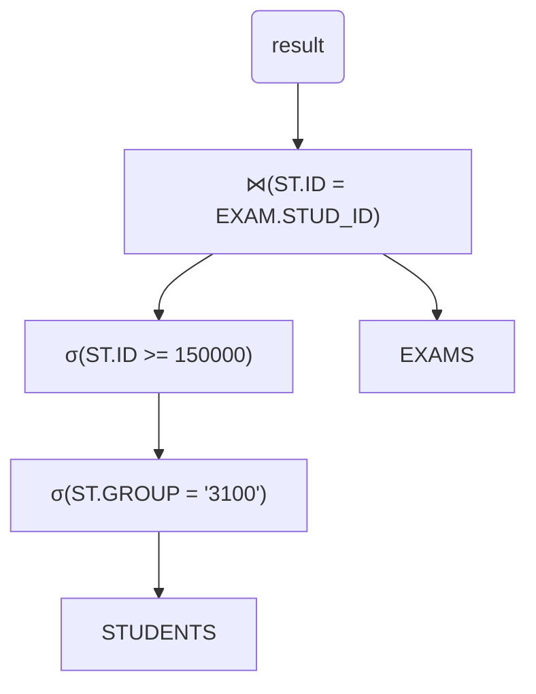

В предыдущей главе мы научились проектировать структуру базы данных с помощью ER-моделей и создавать таблицы с помощью SQL. Но как убедиться, что полученная структура таблиц (схема) является "хорошей"? Не приведет ли она к проблемам при работе с данными?

Именно для ответа на эти вопросы существует процесс **нормализации**.

### Часть 1: Реляционное представление и Реляционная Алгебра (Краткое Повторение и Дополнение)

Прежде чем говорить о нормализации, вспомним ключевые моменты реляционной модели и введем несколько понятий из **реляционной алгебры** – формального языка для манипулирования отношениями (таблицами).

*   **Отношение (Таблица):** Набор кортежей (строк).
*   **Атрибут (Столбец):** Имеет имя и домен (тип данных).
*   **Кортеж (Строка):** Набор значений атрибутов.
*   **Ключ:** Атрибут(ы), уникально идентифицирующий кортеж.

**Реляционная Алгебра:**

Это набор операций над отношениями, результатом которых всегда является новое отношение. Нам понадобятся основные операции для понимания того, как СУБД может выполнять запросы и как устроена нормализация.

1.  **Выборка (Selection, σ):** Выбирает кортежи (строки) из отношения, удовлетворяющие заданному условию (предикату `φ`).
    *   **Обозначение:** `σ<0xCF><0x86>(R)` - выбрать строки из отношения R, где условие `φ` истинно.
    *   **SQL аналог:** Условие в секции `WHERE`.
    *   **Пример:** Выбрать студентов группы '3100', чей ID >= 150000.
        *   SQL: `SELECT * FROM STUDENTS WHERE STUDENTS.GROUP = '3100' AND STUDENTS.ID >= 150000;`
        *   Рел. Алгебра: `σ(STUDENTS.GROUP='3100')∧(STUDENTS.ID>=150000)(STUDENTS)`
        *(Здесь `∧` означает логическое "И")*

2.  **Проекция (Projection, π):** Выбирает указанные атрибуты (столбцы) из отношения, удаляя дубликаты строк в результирующем отношении.
    *   **Обозначение:** `π<0xD0><0xB0><0xD1><0x82><0xD1><0x80><0xD0><0xB8><0xD0><0xB1><0xD1><0x83><0xD1><0x82><0xD1><0x8B>(R)` - выбрать столбцы `<атрибуты>` из отношения R.
    *   **SQL аналог:** Список столбцов в секции `SELECT`. Удаление дубликатов соответствует `SELECT DISTINCT`.
    *   **Пример:** Получить имена и группы всех студентов.
        *   SQL: `SELECT DISTINCT name, group FROM STUDENTS;`
        *   Рел. Алгебра: `πname, group(STUDENTS)`

3.  **Соединение (Join, ⋈):** Комбинирует кортежи из двух отношений на основе некоторого условия (`θ`, тета).
    *   **Тета-соединение (Theta Join):** `R ⋈θ S`. Общий случай, где `θ` - любое условие сравнения между атрибутами R и S. Логически эквивалентно: `σθ(R × S)` (выборка из декартова произведения).
    *   **Эквисоединение (Equijoin):** Частный случай тета-соединения, где условие `θ` содержит только операции равенства (`=`).
    *   **Естественное соединение (Natural Join):** Эквисоединение по *всем* атрибутам с одинаковыми именами, причем совпадающие столбцы включаются в результат только один раз.
    *   **SQL аналог:** Операторы `JOIN`. `INNER JOIN ON условие` соответствует тета-соединению или эквисоединению. `NATURAL JOIN` соответствует естественному соединению.
    *   **Пример:** Соединить студентов и их экзамены по ID студента.
        *   SQL: `SELECT * FROM STUDENTS JOIN EXAMS ON STUDENTS.ID = EXAMS.STUD_ID;`
        *   Рел. Алгебра: `STUDENTS ⋈STUDENTS.ID=EXAMS.STUD_ID EXAMS`

**Законы Реляционной Алгебры (Примеры Эквивалентных Преобразований):**

СУБД использует правила эквивалентности для преобразования запроса в *различные планы выполнения*, чтобы выбрать наиболее эффективный.

*   Соединение коммутативно (для `INNER JOIN`): `R ⋈θ S ≡ S ⋈θ R`
*   Соединение ассоциативно (для `INNER JOIN`): `R ⋈θ (S ⋈φ T) ≡ (R ⋈θ S) ⋈φ T`
*   Каскад выборок: `σθ∧φ(R) ≡ σθ(σφ(R))`
*   "Проталкивание" выборки через соединение: Если условие `φ` относится только к атрибутам `R`, то: `σφ(R ⋈θ S) ≡ (σφ(R)) ⋈θ S`. *Это важное правило оптимизации: выполнять выборку как можно раньше, чтобы уменьшить размер данных для соединения.*
*   "Проталкивание" проекции через соединение (сложнее): `πA(R ⋈θ S)` можно преобразовать, оставив в `R` и `S` только те атрибуты, которые нужны для результата (`A`) и для условия соединения (`θ`). *Тоже важное правило: отбрасывать ненужные столбцы как можно раньше.*

**План Выполнения Запроса:**

Это последовательность операций реляционной алгебры (и конкретных алгоритмов их выполнения), которую СУБД строит для ответа на SQL-запрос. Часто представляется в виде дерева операций. Для одного SQL-запроса может существовать несколько *эквивалентных* планов (дающих одинаковый результат), но с разной *стоимостью* выполнения. Оптимизатор запросов выбирает план с наименьшей предполагаемой стоимостью.


*Пример одного из возможных планов для запроса `SELECT * FROM STUDENTS ST JOIN EXAMS EXAM ON ST.ID = EXAM.STUD_ID WHERE ST.GROUP = '3100' AND ST.ID >= 150000;`*

### Часть 2: Проблемы Плохого Дизайна и Аномалии

Зачем нам вообще нужна нормализация, если мы можем просто создать одну большую таблицу со всеми нужными данными? Рассмотрим таблицу `STUDENTS` с информацией о студентах, их группах и кураторах (GrMentor - Куратор Группы).

**Таблица `STUDENTS` (Ненормализованная)**

| StudID | StudName     | Group | GrMentor   |
| :----- | :----------- | :---- | :--------- |
| 1      | Ivan Petrov  | P3100 | Egor Kirov |
| 3      | Vasily Ivanov| P3101 | Roman Ivov |
| 34     | Gleb Anisimov| P3100 | Egor Kirov |

**Проблемы:**

1.  **Избыточность Данных:** Информация о кураторе (`GrMentor`) повторяется для каждого студента из одной и той же группы (Egor Kirov для группы P3100). Это ведет к неэффективному использованию памяти.
2.  **Аномалии Обновления (Update Anomalies):** Если куратор группы P3100 сменится, нам придется обновить поле `GrMentor` во *всех* строках, где `Group = 'P3100'`. Если мы обновим не все строки, данные станут противоречивыми (у одной группы окажется несколько кураторов).
    ```sql
    -- Попытка сменить куратора только для одного студента
    UPDATE STUDENTS
    SET GrMentor = 'Eugene Lomov'
    WHERE StudName = 'Ivan Petrov';
    ```
    **Результат (Несогласованность):**
    | StudID | StudName     | Group | GrMentor      |
    | :----- | :----------- | :---- | :------------ |
    | 1      | Ivan Petrov  | P3100 | Eugene Lomov  | <-- Новый куратор
    | 3      | Vasily Ivanov| P3101 | Roman Ivov    |
    | 34     | Gleb Anisimov| P3100 | Egor Kirov    | <-- Старый куратор!

3.  **Аномалии Вставки (Insertion Anomalies):**
    *   Мы не можем добавить информацию о новой группе и ее кураторе, пока в этой группе нет хотя бы одного студента (потому что `StudID`, вероятно, часть первичного ключа или просто идентификатор студента, который не может быть `NULL` для информации о группе).
    *   При добавлении нового студента в существующую группу, мы должны *правильно* указать ее куратора. Ошибка при вводе имени куратора приведет к несогласованности (см. пример со слайда 26, где `E.Kirov` и `Egor Lomov` могут быть одним человеком).
    ```sql
    -- Попытка добавить студентов с разными написаниями куратора
    INSERT INTO STUDENTS VALUES(57, 'Nina Simonova', 'P3100', 'E. Kirov');
    INSERT INTO STUDENTS VALUES(58, 'Petr Uvarov', 'P3100', 'Egor Lomov');
    ```

4.  **Аномалии Удаления (Deletion Anomalies):** Если мы удалим последнего студента из какой-либо группы (например, Василия Иванова из P3101), мы потеряем информацию о самой группе P3101 и ее кураторе Романе Ивове, даже если эта информация нам еще нужна.
    ```sql
    DELETE FROM STUDENTS
    WHERE StudName = 'Vasily Ivanov';
    ```
    *После этого запроса информация о группе P3101 и ее кураторе исчезнет из таблицы.*

Все эти проблемы возникают из-за того, что в одной таблице смешаны данные о разных сущностях (студенты и группы/кураторы) и существуют "неправильные" зависимости между атрибутами. Нормализация помогает выявить и устранить эти проблемы.

### Часть 3: Функциональные Зависимости (ФЗ)

Ключевое понятие для нормализации.

*   **Функциональная зависимость (Functional Dependency, FD)** описывает смысловую связь между атрибутами *внутри одного отношения (таблицы)*.
*   Говорят, что атрибут (или набор атрибутов) `B` **функционально зависит** от атрибута (или набора атрибутов) `A`, если для *каждого* возможного значения `A` существует *ровно одно* соответствующее значение `B`.
*   **Обозначение:** `A → B` (читается "A функционально определяет B" или "B функционально зависит от A").
*   `A` называется **детерминантом**.

**Важно:** ФЗ определяются **смыслом данных (семантикой)** предметной области, а не текущими данными в таблице!

**Примеры ФЗ для таблицы `STUDENTS` (StudID, StudName, Group, GrMentor):**

*   `StudID → StudName` (По ID студента однозначно определяется его имя).
*   `StudID → Group` (По ID студента однозначно определяется его группа).
*   `StudID → GrMentor` (По ID студента можно узнать его группу, а по группе - куратора, т.е. косвенно ID определяет куратора).
*   `Group → GrMentor` (По номеру группы однозначно определяется ее куратор. Предполагаем, что у группы только один куратор).
*   `StudID, Group → GrMentor` (Тоже верно, но избыточно, т.к. `Group` уже зависит от `StudID`).

**Примеры НЕ ФЗ:**

*   `Group → StudID` (Неверно, т.к. в одной группе много студентов).
*   `StudName → StudID` (Неверно, т.к. могут быть тезки).

**Типы ФЗ:**

*   **Тривиальная ФЗ:** Зависимость вида `A → B`, где `B` является подмножеством `A`. Например, `{StudID, StudName} → StudName`. Такие зависимости выполняются всегда и не несут полезной информации для нормализации. Обычно рассматривают только **нетривиальные** ФЗ.
*   **Полная ФЗ:** Зависимость `A → B`, где `A` – составной детерминант (несколько атрибутов), и `B` не зависит ни от какого *подмножества* `A`. Мы уже обсуждали это в контексте 2НФ.
*   **Частичная ФЗ:** Зависимость `A → B`, где `A` – составной детерминант, и `B` зависит от *части* `A`. (Пример: `{StudID, ExamID} → StudName`, но при этом `StudID → StudName`. Здесь `StudName` частично зависит от ключа).
*   **Транзитивная ФЗ:** Зависимость `A → C`, которая существует только через промежуточный атрибут `B`, такой что `A → B` и `B → C`, при этом `B` не зависит от `A` (`B → A` неверно) и `B` не является частью ключа `A`. (Пример: `StudID → Group` и `Group → GrMentor`, следовательно, `StudID → GrMentor` транзитивно через `Group`).

**Аксиомы Армстронга:** Формальные правила для вывода новых ФЗ из существующих:

1.  **Рефлексивность:** Если `B ⊆ A`, то `A → B`. (Тривиальная зависимость).
2.  **Дополнение (Augmentation):** Если `A → B`, то `A, C → B, C`. (Добавление атрибута `C` к обеим частям).
3.  **Транзитивность:** Если `A → B` и `B → C`, то `A → C`.

Эти аксиомы позволяют формально вывести все возможные ФЗ для отношения, зная некоторый начальный набор.

### Часть 4: Нормальные Формы

Процесс нормализации заключается в последовательном приведении таблиц к нормальным формам более высокого порядка. Каждая следующая нормальная форма накладывает более строгие ограничения.

**Ненормализованная Форма (UNF / 0NF):**
Таблица содержит неатомарные значения (повторяющиеся группы, списки в ячейках). Это нарушает основные принципы реляционной модели.

**Пример (из слайда 38):**

| StudID | StudName    | ExamID | ExamName | ExDate      | ProfID | ProfName    |
| :----- | :---------- | :----- | :------- | :---------- | :----- | :---------- |
| 123    | Ivan Ivanov | 34     | OPD      | 14.01.19    | 55     | Rebrov A.   |
|        |             | 78     | DBMS     | 29.12.20    | 789    | Uvarov S.   |
| 345    | Egor Kirov  | 34     | OPD      | 14.01.19    | 55     | Rebrov A.   |
|        |             | 87     | History  | 25.01.19    | 342    | Serov G.    |

Здесь у одного студента несколько экзаменов, дат, преподавателей - значения неатомарны.

**Первая Нормальная Форма (1НФ):**

*   **Правило:** Отношение находится в 1НФ, если все его атрибуты содержат только **атомарные** (неделимые) значения. На пересечении строки и столбца - ровно одно значение из домена.

Как достичь:
1.  **(Плохой способ) "Расплющить" таблицу:** Создать отдельную строку для каждого значения из повторяющейся группы. Это приводит к сильной избыточности.
	**Пример (из слайда 40):**

| StudID | StudName    | ExamID | ExamName | ExDate   | ProfID | ProfName  |
| :----- | :---------- | :----- | :------- | :------- | :----- | :-------- |
| 123    | Ivan Ivanov | 34     | OPD      | 14.01.19 | 55     | Rebrov A. |
| 123    | Ivan Ivanov | 78     | DBMS     | 29.12.20 | 789    | Uvarov S. |
| 345    | Egor Kirov  | 34     | OPD      | 14.01.19 | 55     | Rebrov A. |
| 345    | Egor Kirov  | 87     | History  | 25.01.19 | 342    | Serov G.  |
*Теперь значения атомарны, но информация о студенте Иванове и Кирове дублируется.*

2.  **(Хороший способ) Декомпозиция:** Разделить таблицу на несколько, вынеся повторяющиеся группы в отдельную таблицу со связью через внешний ключ.
	**Пример (из слайда 41):**

**Таблица `STUDENTS`**

| StudID (PK) | StudName    |
| :---------- | :---------- |
| 123         | Ivan Ivanov |
| 345         | Egor Kirov  |
**Таблица `EXAMS`**

| StudID (FK) | ExamID | ExamName | ExDate   | ProfID | ProfName  |
| :---------- | :----- | :------- | :------- | :----- | :-------- |
| 123         | 34     | OPD      | 14.01.19 | 55     | Rebrov A. |
| 123         | 78     | DBMS     | 29.12.20 | 789    | Uvarov S. |
| 345         | 34     | OPD      | 14.01.19 | 55     | Rebrov A. |
| 345         | 87     | History  | 25.01.19 | 342    | Serov G.  |
*Теперь обе таблицы в 1НФ.*

**Вторая Нормальная Форма (2НФ):**

*   **Правило:** Отношение находится в 2НФ, если оно находится в 1НФ и все **неключевые атрибуты полностью функционально зависят** от *каждого* потенциального ключа. (Нет частичных зависимостей от ключа).
*   **Актуально для таблиц с составными первичными ключами.**
*   **Цель:** Устранить избыточность, возникающую из-за того, что неключевой атрибут зависит только от части составного ключа.
*   **Как достичь:** Вынести частично зависимые атрибуты и ту часть ключа, от которой они зависят, в отдельную таблицу.

**Пример (используем "расплющенную" таблицу из 1НФ):**

*   Первичный ключ: `{StudID, ExamID}`.
*   Неключевые атрибуты: `StudName`, `ExamName`, `ExDate`, `ProfID`, `ProfName`.
*   **Частичные зависимости:**
    *   `StudID → StudName` (Зависит только от части ключа - `StudID`).
    *   `ExamID → ExamName` (Зависит только от части ключа - `ExamID`).
*   **Полные зависимости:**
    *   `{StudID, ExamID} → ExDate` (Предполагаем, что дата зависит от студента и экзамена).
    *   `{StudID, ExamID} → ProfID` (Предполагаем, что преподаватель зависит от студента и экзамена).
*   **Другие зависимости:**
    *   `ProfID → ProfName` (Имя преподавателя зависит от его ID).

*Таблица не в 2НФ из-за частичных зависимостей `StudName` и `ExamName`.*

**Декомпозиция для 2НФ:**

1.  Выносим `StudID → StudName`:
    *   Новая таблица `STUDENTS`: `{StudID (PK), StudName}`.
    *   Старая таблица (переименуем в `EXAMS_PARTICIPATION`): `{StudID (FK), ExamID (PK), ExamName, ExDate, ProfID, ProfName}`. (StudName удален).
2.  Выносим `ExamID → ExamName` из `EXAMS_PARTICIPATION`:
    *   Новая таблица `EXAMS`: `{ExamID (PK), ExamName}`.
    *   Таблица `EXAMS_PARTICIPATION`: `{StudID (FK), ExamID (FK), ExDate, ProfID, ProfName}`. (ExamName удален). Первичный ключ теперь `{StudID, ExamID}`.

**Результат (все таблицы в 2НФ):**

**Таблица `STUDENTS`**

| StudID (PK) | StudName    |
| :---------- | :---------- |
| 123         | Ivan Ivanov |
| 345         | Egor Kirov  |

**Таблица `EXAMS`**

| ExamID (PK) | ExamName |
| :---------- | :------- |
| 34          | OPD      |
| 78          | DBMS     |
| 87          | History  |

**Таблица `EXAMS_PARTICIPATION`**

| StudID (FK, PK) | ExamID (FK, PK) | ExDate   | ProfID | ProfName  |
| :-------------- | :-------------- | :------- | :----- | :-------- |
| 123             | 34              | 14.01.19 | 55     | Rebrov A. |
| 123             | 78              | 29.12.20 | 789    | Uvarov S. |
| 345             | 34              | 14.01.19 | 55     | Rebrov A. |
| 345             | 87              | 25.01.19 | 342    | Serov G.  |

**Третья Нормальная Форма (3НФ):**

*   **Правило:** Отношение находится в 3НФ, если оно находится в 2НФ и все **неключевые атрибуты нетранзитивно зависят** от *каждого* потенциального ключа. (Нет транзитивных зависимостей неключевых атрибутов от ключа через другие неключевые атрибуты).
*   **Цель:** Устранить избыточность, возникающую из-за того, что неключевой атрибут зависит от другого неключевого атрибута.
*   **Как достичь:** Вынести транзитивно зависимые атрибуты и их непосредственный детерминант в отдельную таблицу.

**Пример (используем таблицы из 2НФ):**

*   В таблицах `STUDENTS` и `EXAMS` нет транзитивных зависимостей (там просто ключ и один неключевой атрибут).
*   Рассмотрим `EXAMS_PARTICIPATION`:
    *   Первичный ключ: `{StudID, ExamID}`.
    *   Неключевые атрибуты: `ExDate`, `ProfID`, `ProfName`.
    *   **Зависимости:**
        *   `{StudID, ExamID} → ExDate` (Полная)
        *   `{StudID, ExamID} → ProfID` (Полная)
        *   `ProfID → ProfName` (Зависимость между неключевыми атрибутами!)
    *   **Транзитивная зависимость:** `{StudID, ExamID} → ProfID` и `ProfID → ProfName`, следовательно, `ProfName` *транзитивно* зависит от первичного ключа через `ProfID`.

*Таблица `EXAMS_PARTICIPATION` не в 3НФ.*

**Декомпозиция для 3НФ:**

1.  Выносим `ProfID → ProfName` из `EXAMS_PARTICIPATION`:
    *   Новая таблица `PROFS`: `{ProfID (PK), ProfName}`.
    *   Таблица `EXAMS_PARTICIPATION`: `{StudID (FK, PK), ExamID (FK, PK), ExDate, ProfID (FK)}`. (ProfName удален, ProfID остался как внешний ключ к `PROFS`).

**Результат (все таблицы в 3НФ):**

**Таблица `STUDENTS`** (без изменений)
**Таблица `EXAMS`** (без изменений)

**Таблица `PROFS`**

| ProfID (PK) | ProfName  |
| :---------- | :-------- |
| 55          | Rebrov A. |
| 789         | Uvarov S. |
| 342         | Serov G.  |

**Таблица `EXAMS_PARTICIPATION`**

| StudID (FK, PK) | ExamID (FK, PK) | ExDate   | ProfID (FK) |
| :-------------- | :-------------- | :------- | :---------- |
| 123             | 34              | 14.01.19 | 55          |
| 123             | 78              | 29.12.20 | 789         |
| 345             | 34              | 14.01.19 | 55          |
| 345             | 87              | 25.01.19 | 342         |

**Нормальная Форма Бойса-Кодда (НФБК / BCNF):**

*   **Более строгая версия 3НФ.**
*   **Правило:** Отношение находится в НФБК, если для *каждой* нетривиальной функциональной зависимости `A → B`, детерминант `A` является **суперключом** (т.е. содержит в себе потенциальный ключ).
*   Большинство таблиц в 3НФ также находятся и в НФБК. Проблемы могут возникнуть при наличии нескольких перекрывающихся потенциальных ключей.
*   Часто является конечной целью нормализации на практике.

**Высшие нормальные формы (4НФ, 5НФ):**
Существуют и другие нормальные формы (4НФ, 5НФ, DKNF), которые решают более тонкие проблемы, связанные с многозначными зависимостями и зависимостями соединения. На практике они используются редко. Обычно достаточно достичь 3НФ или НФБК.

### Часть 5: Денормализация

Иногда, после приведения базы данных к высокой нормальной форме (например, 3НФ или НФБК), оказывается, что для выполнения частых запросов требуется слишком много операций соединения (`JOIN`) между таблицами. Это может снижать производительность.

В таких случаях иногда прибегают к **денормализации** — процессу **осознанного** нарушения некоторых правил нормализации для повышения производительности запросов.

*   **Прием:** Объединение нескольких таблиц в одну, добавление избыточных данных.
*   **Плюсы:**
    *   Уменьшение количества соединений в запросах.
    *   Потенциальное ускорение выполнения частых запросов на чтение.
*   **Минусы:**
    *   Увеличение избыточности данных (занимает больше места).
    *   Повышенный риск аномалий (вставки, обновления, удаления).
    *   Требуется больше усилий для поддержания целостности данных (например, с помощью триггеров или на уровне приложения).

Денормализацию следует применять **осторожно**, только после тщательного анализа производительности и понимания всех рисков. Обычно она является оправданной в системах с преобладанием операций чтения (например, в хранилищах данных для аналитики), где скорость выборки критически важна.
